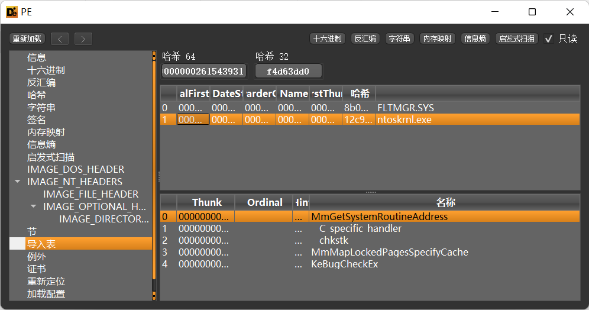
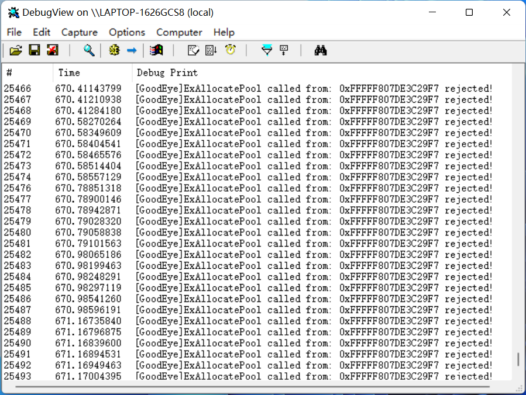

# BlindEye: BattlEye内核模块bypass

## 摘要

通过hook BattlEye内核模块导入的  `ExAllocatePool`、`ExAllocatePoolWithTag `函数，过滤掉report数据包的内存申请，实现内核检测bypass。

## 背景知识

### BattlEye内核模块导入表

如下图所示，BattlEye内核模块的导入表中只导入了很少的系统函数，例如：`MmGetSystemRoutineAddress`、`FltGetRoutineAddress`等。其余大量导入函数是通过调用`MmGetSystemRoutineAddress`、`FltGetRoutineAddress`获得的。



### report函数分析

BattlEye内核模块在发现异常情况时会发送数据包，通过逆向分析脱掉vmp之后的代码，可以看到上报代码如下所示。

1. 自定义信息上报（不加密）

```c++
void __fastcall daisy::report::custom(const void *Buffer, __int64 Size, ReportNode **Head, ReportNode **Tail)
{
    ReportNode *Node; // rbx
    void *Data; // rax

    Node = (ReportNode *)fn_ExAllocatePool(1i64, 24i64);
    if ( Node )
    {
        Data = (void *)fn_ExAllocatePool(1i64, Size);
        Node->Data = Data;
        if ( Data )
        {
            Node->Size = Size;
            memmove(Data, Buffer, (unsigned int)Size);
            Node->Next = 0i64;
            Node->UnknownFlag = 0;
            fn_KeWaitForSingleObject(&g_Mutex, 0i64, 0i64, 0i64, 0i64);
            if ( *Head )
                (*Tail)->Next = Node;
            else
                *Head = Node;
            *Tail = Node;
            fn_KeReleaseMutex(&g_Mutex, 0i64);
        }
        else
        {
            fn_ExFreePoolWithTag(Node, 0i64);
        }
    }
}
```

2. 普通数据上报（简单异或加密，不知道最新版本有没有更换加密算法啊）

```c++
void __fastcall daisy::report::normal(const void *Buffer, int Size)
{
    ReportNode *Node; // rbx
    void *Data; // rax
    int Key; // eax
    char ByteKey; // r8
    char *EncryptBuffer; // rcx
    int i; // edx
    signed __int64 v10; // rdi
    char t; // al
    __int64 TickCount; // [rsp+50h] [rbp+18h] BYREF

    Node = (ReportNode *)fn_ExAllocatePoolWithTag(1i64, 24i64, 'EB');
    if ( Node )
    {
        Node->Size = Size + 4;
        Data = (void *)fn_ExAllocatePoolWithTag(1i64, (unsigned int)(Size + 4), 'EB');// the first 4 bytes is the key
        Node->Data = Data;
        if ( Data )
        {
            TickCount = MEMORY[0xFFFFF78000000320];
            Key = fn_RtlRandomEx(&TickCount);
            ByteKey = Key;
            *(_DWORD *)Node->Data = Key;
            EncryptBuffer = (char *)Node->Data + 4;
            if ( Node->Data == (PVOID)-4i64 )   // WTF?
                EncryptBuffer = (char *)Buffer;
            i = 0;
            if ( Size > 0 )
            {
                v10 = (_BYTE *)Buffer - EncryptBuffer;
                do
                {
                    t = i++ ^ ByteKey ^ EncryptBuffer[v10];// EncryptBuffer[v10] just means Buffer[i]
                    t ^= 0xA5u;
                    *EncryptBuffer++ = t;
                    ByteKey = ~t;
                }
                while ( i < Size );
            }
            Node->Next = 0i64;
            fn_KeWaitForSingleObject(&g_Mutex, 0i64, 0i64, 0i64, 0i64);
            if ( g_EncryptHead )
                g_EncryptTail->Next = Node;
            else
                g_EncryptHead = Node;
            g_EncryptTail = Node;
            fn_KeReleaseMutex(&g_Mutex, 0i64);
        }
        else
        {
            fn_ExFreePoolWithTag(Node, 0i64);
        }
    }
}
```

其数据结构如下：

```
+----------+                              +----------+
|   Head   |                              |   Tail   |
+----------+                              +----------+
     |                                         |
     V                                         V
+----------+     +----------+             +----------+
|  Node 1  | --> |  Node 2  | --> ... --> |  Node n  |
+----------+     +----------+             +----------+
     |                |                        |
     V                V                        V
+----------+     +----------+             +----------+
|  Data 1  |     |  Data 2  |             |  Data n  |
+----------+     +----------+             +----------+
```

注意到：

1. 每个链表节点的大小均为24字节，且类型均为`PagedPool`。

```c++
Node = (ReportNode *)fn_ExAllocatePool(1i64, 24i64);
```

```c++
Node = (ReportNode *)fn_ExAllocatePoolWithTag(1i64, 24i64, 'EB');
```

2. 如果report数据包申请失败，则**函数直接返回，不会有额外的影响**。

## BlindEye

本项目基于GoodEye开发。

### 设计思路

通过调用`PsSetLoadImageNotifyRoutine`注册回调，监控BEDaisy.sys内核模块的加载，通过IAT hook `MmGetSystemRoutineAddress`函数，在BattlEye模块调用`MmGetSystemRoutineAddress`获得其他导入函数地址时，再次返回对应hook函数地址，以此实现hook其他导入函数。

我们需要hook的函数是`ExAllocatePool`、`ExAllocatePoolWithTag `，在函数中过滤掉类型为`PagedPool`，大小为24的申请内存的请求。

需要注意的是，有些其他函数也会调用`ExAllocatePool`、`ExAllocatePoolWithTag `这两个函数申请内存，我们需要将这些请求放行，否则BattlEye无法正常启动。我使用的方法是白名单策略，如果调用者以前申请过不被过滤的内存，则该调用者列入白名单，后续的所有申请都会放行。只过滤不在白名单且类型为`PagedPool`，大小为24的申请。

具体代码如下：

```c++
	PVOID gh_ExAllocatePoolWithTag(
		POOL_TYPE PoolType,
		SIZE_T NumberOfBytes,
		ULONG Tag
	) {
		const int WhiteListSize = 1000;
		static void* WhiteList[WhiteListSize]{};
		static int size = 0;
		void* ReturnAddress = _ReturnAddress();

		for (int i = 0; i < size; i++) {
			if (WhiteList[i] == ReturnAddress) {
				return ExAllocatePoolWithTag(PoolType, NumberOfBytes, Tag);
			}
		}
		if (PoolType == 1 && NumberOfBytes == 24) {
			DBG_PRINT("ExAllocatePoolWithTag called from: 0x%p rejected!", ReturnAddress);
			return nullptr;
		}
		else {
			if (size < WhiteListSize) {
				WhiteList[size++] = ReturnAddress;
				return ExAllocatePoolWithTag(PoolType, NumberOfBytes, Tag);
			}
			else {
				DBG_PRINT("ExAllocatePoolWithTag WhiteList is full");
				return nullptr;
			}
		}
	}
```

### 运行截图



## 相关工作

BattlEye去虚拟化内核模块：https://www.unknowncheats.me/forum/anti-cheat-bypass/489381-bedaisy-sys-devirtualized.html

BattlEye逆向分析：https://github.com/dllcrt0/bedaisy-reversal

GoodEye：https://github.com/huoji120/goodeye
